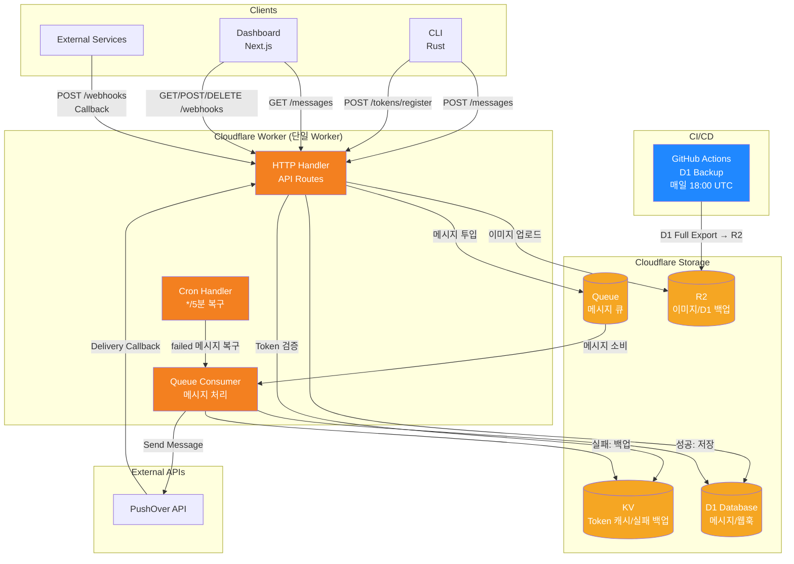
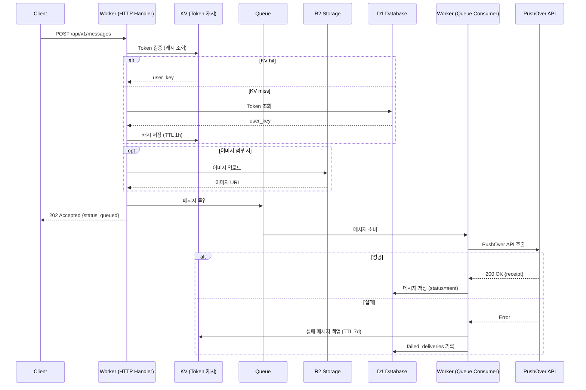
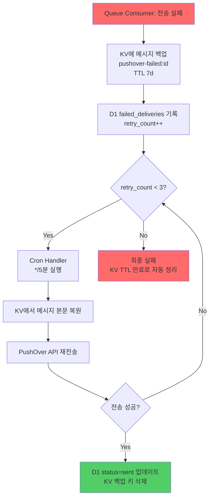
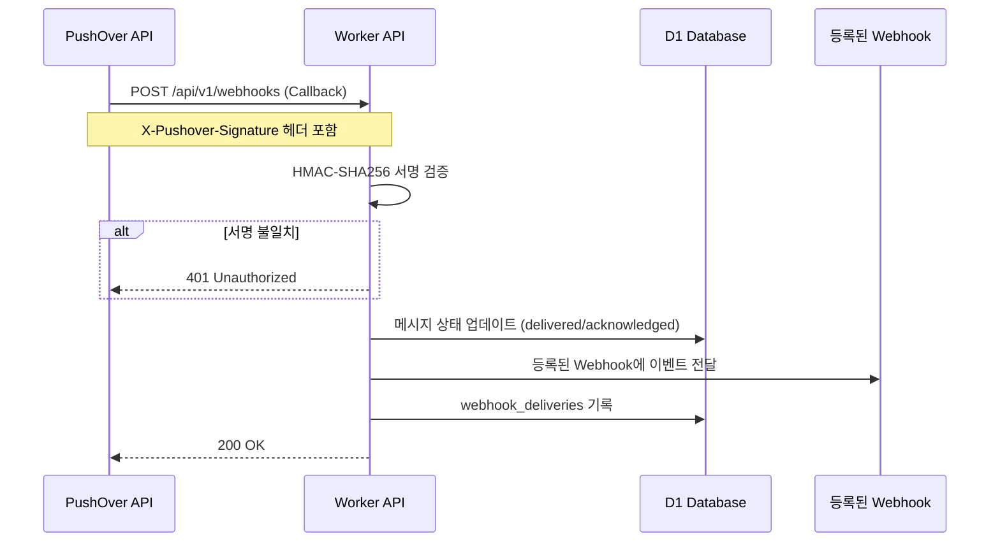
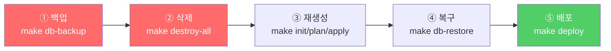
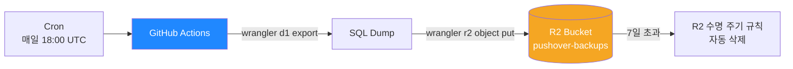
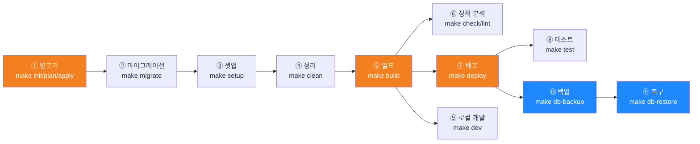

# PushOver Serverless Platform

PushOver API를 위한 Rust 와 TypeScript 기반의 Cloudflare Serverless 알림 시스템입니다.

## 목차

- [아키텍처](#-아키텍처)
- [Cloudflare 서비스](#-cloudflare)
- [프로젝트 구조](#-프로젝트-구조)
- [데이터베이스](#-데이터베이스)
- [개발 시나리오](#-개발-시나리오)

---

## 🏗️ 아키텍처

### 전체 시스템 아키텍처



### 메시지 전송 흐름 (Queue-First)



### 재시도 메커니즘 (Cron + KV)



### 웹훅 처리 흐름



### 웹훅 서명 검증


---

## ☁️ Cloudflare

| 서비스 | 용도 | 관리 도구 |
| -------- | ------ | ---------- |
| **Workers** | Serverless API 서버 (Rust/WASM) | Wrangler |
| **Pages** | 정적 호스팅 (Dashboard) | Wrangler |
| **Queues** | 비동기 메시지 큐 (Producer-Consumer) | OpenTofu |
| **KV** | Token 캐시, Webhook 캐시, 실패 메시지 백업 | OpenTofu |
| **D1** | SQLite 기반 DB (스키마: [`migrations/`](./migrations/)) | OpenTofu |
| **R2** | 오브젝트 스토리지 (Terraform state, D1 백업, 메시지 이미지) | OpenTofu |
| **Cron Triggers** | 스케줄러 (Recovery Worker, */5분) | OpenTofu |

### 삭제 및 복구 절차



| # | 단계 | 명령 | 설명 |
| - | ---- | ---- | ---- |
| ① | 백업 | `make db-backup` | D1 → 로컬 SQL dump (삭제 전 필수) |
| ② | 삭제 | `make destroy-all` | Pages,Worker → 인프라(D1, KV, R2, Queues, Cron) 순서대로 전체 삭제 |
| ③ | 재생성 | `make init && make plan && make apply` | OpenTofu로 인프라 재생성 |
| ④ | 복구 | `make db-restore file=backups/d1-xxx.sql` | SQL dump(스키마+데이터) → D1 복구 |
| ⑤ | 배포 | `make deploy` | Worker + Pages 재배포 |

---

## 📦 프로젝트 구조

```bash
pushover/
├── crates/
│   ├── sdk/                    # Rust SDK
│   ├── cli/                    # CLI 도구
│   └── worker/                 # Cloudflare Worker
│       └── wrangler.toml
├── dashboard/                  # Next.js 웹 UI
├── migrations/                  # D1 마이그레이션
├── infrastructure/              # OpenTofu 인프라
└── docs/                       # 문서
```

---

## 🗄️ 데이터베이스

### 스키마

> 상세: [`migrations/`](./migrations/) SQL 파일 참조

**D1 테이블**:

- `api_tokens` - API 인증 토큰
- `messages` - 메시지 전송 기록
- `webhooks` - 웹훅 등록 정보
- `webhook_deliveries` - 웹훅 전송 기록
- `failed_deliveries` - 실패한 메시지 (재시도용)

### 백업



| 항목 | 내용 |
| ------ | ------ |
| **워크플로우** | `.github/workflows/d1-backup.yml` |
| **주기** | 매일 18:00 UTC (한국 03:00) + `workflow_dispatch` 수동 실행 |
| **방식** | `wrangler d1 export` → 전체 SQL dump |
| **저장소** | R2 `pushover-backups/d1-full-backup/` |
| **보존** | 7일 (R2 버킷 수명 주기 규칙으로 자동 삭제) |

### 복구

| 항목 | 내용 |
| ------ | ------ |
| **방식** | `wrangler d1 execute --file=backup.sql` |
| **로컬** | `make db-restore-local file=backups/xxx.sql` |
| **원격** | `make db-restore file=backups/xxx.sql` |

> **참고**: `tofu destroy`로 R2 버킷도 삭제되면 R2 내 D1 백업도 함께 삭제됩니다. 전체 삭제 전 반드시 `make db-backup`으로 로컬에 SQL dump를 확보하세요.

---

## 🚀 개발 시나리오

모든 명령은 `Makefile` 타겟으로 관리됩니다. 각 타겟의 상세 내용은 `Makefile` 주석을 참조하세요.

### 사전 요구사항

- Rust >= 1.92.0
- Node.js >= v24.14.0

### 환경변수

```bash
cp .env.example .env
# .env 파일을 실제 값으로 변경
```

| 변수명 | 발급처 |
| -------- | -------- |
| `CLOUDFLARE_API_TOKEN` | [Cloudflare Dashboard](https://dash.cloudflare.com/profile/api-tokens) |
| `CLOUDFLARE_ACCOUNT_ID` | Cloudflare Dashboard 사이드바 |
| `PUSHOVER_USER_KEY` | [PushOver](https://pushover.net) |
| `PUSHOVER_API_TOKEN` | PushOver Settings → Applications |
| `PUSHOVER_WEBHOOK_SECRET` | `openssl rand -base64 32` |

### 개발 프로세스



| # | 단계 | make 타겟 | 설명 |
|---|------|-----------|------|
| ① | 인프라 | `make init && make plan && make apply` | OpenTofu로 D1, KV, R2, Cron 생성 |
| ② | 마이그레이션 | `make migrate` | D1 스키마 적용 |
| ③ | 셋업 | `make setup` | pnpm install + Rust workspace check |
| ④ | 정리 | `make clean` | 빌드 산출물 전체 삭제 |
| ⑤ | 빌드 | `make build` | Dashboard (Next.js) + Worker (WASM) |
| ⑥ | 정적 분석 | `make check` / `make lint` | 타입 검사 / clippy 린트 |
| ⑦ | 배포 | `make deploy` | Cloudflare Pages + Workers 배포 |
| ⑧ | 테스트 | `make test` | SDK → CLI → Worker → Dashboard |
| ⑨ | 로컬 개발 | `make dev` | wrangler dev + Next.js dev 서버 |
| ⑩ | 백업 | `make db-backup` | D1 전체 SQL dump |
| ⑪ | 복구 | `make db-restore file=...` | SQL dump → D1 복구 |

---

## 📝 라이선스

MIT
