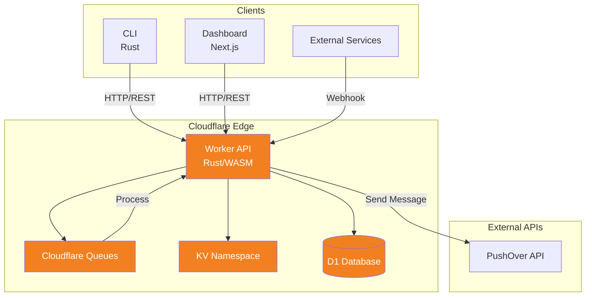
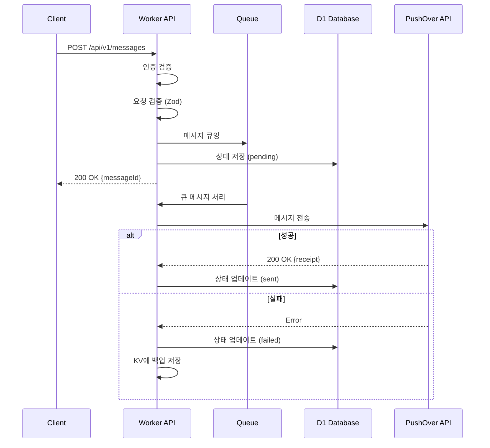
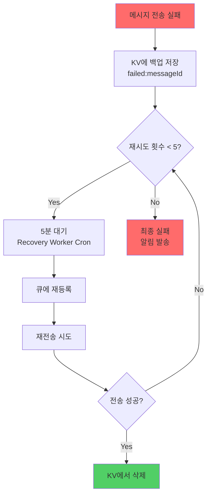
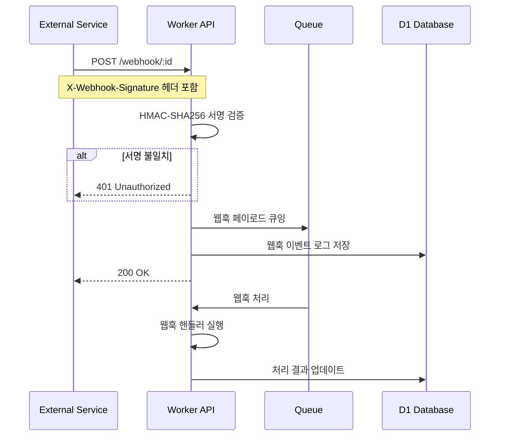
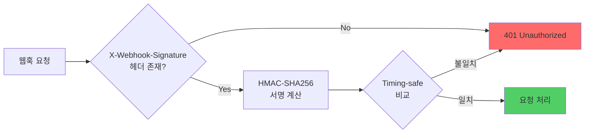

# PushOver Serverless Platform

PushOver API를 위한 Rust 기반 Serverless 플랫폼입니다. Cloudflare Workers, D1, KV, Queues를 활용한 확장 가능한 알림 시스템입니다.

---

## 🏗️ 아키텍처

### 전체 시스템 아키텍처



### 메시지 전송 흐름



### 재시도 메커니즘



### 웹훅 처리 흐름



### 웹훅 서명 검증



---

## ☁️ Cloudflare 서비스

| 서비스 | 용도 | 비고 |
| -------- | ------ |------|
| **Workers** | Serverless API 서버 | Rust/WASM으로 빌드 |
| **D1** | SQLite 기반 DB | 메시지, 웹훅 이력 저장 |
| **KV** | Key-Value 스토리지 | 실패 메시지 백업 |
| **Queues** | 메시지 큐 | 비동기 메시지 처리 |
| **Pages** | 정적 호스팅 | Dashboard 배포용 |
| **Cron Triggers** | 스케줄러 | Recovery Worker (5분마다) |

---

## 📦 프로젝트 구조

```bash
pushover/
├── crates/
│   ├── sdk/                    # Rust SDK
│   │   ├── src/
│   │   │   ├── lib.rs           # 공개 API
│   │   │   ├── models.rs        # 데이터 모델
│   │   │   ├── error.rs         # 에러 타입
│   │   │   ├── http_client.rs  # HTTP 클라이언트
│   │   │   └── webhook.rs       # 웹훅 검증
│   │   └── tests/
│   │
│   ├── cli/                    # CLI 도구
│   │   ├── src/
│   │   │   ├── main.rs          # 진입점
│   │   │   ├── commands/
│   │   │   │   ├── send.rs      # 메시지 전송
│   │   │   │   └── history.rs   # 이력 조회
│   │   │   └── config.rs        # 설정 관리
│   │
│   └── worker/                 # Cloudflare Worker
│       ├── src/
│       │   ├── lib.rs           # 진입점
│       │   ├── routes/          # API 라우트
│       │   ├── middleware/      # CORS, 인증
│       │   ├── types/           # 요청/응답 타입
│       │   ├── recovery/        # 실패 메시지 복구
│       │   └── utils/           # 유틸리티
│       └── wrangler.toml
│
├── dashboard/                  # Next.js 웹 UI
│   ├── src/
│   │   ├── app/
│   │   │   ├── page.tsx         # 메인 페이지
│   │   │   ├── history/         # 이력 페이지
│   │   │   └── settings/        # 설정 페이지
│   │   └── lib/
│   │       └── api.ts           # API 클라이언트
│   └── package.json
│
├── infrastructure/              # OpenTofu (Terraform)
│   ├── main.tf
│   ├── variables.tf
│   └── outputs.tf
│
├── migrations/                # D1 마이그레이션
│
└── docs/                      # 문서
    └── superpowers/specs/
        └── 2026-03-26-pushover-serverless-design.md
```

---

## 🚀 빠른 시작

### 사전 요구사항

```bash
# Rust
curl --proto '=https' --tlsv1.2 -sSf https://sh.rustup.rs | sh

# mise (SDK 관리)
mise use -g nodejs

# pnpm
npm install -g pnpm

# worker-build
cargo install worker-build
```

### 환경변수 설정

```bash
# .env 복사 및 설정
cp .env.example .env
```

**필수 환경변수** (.env 파일):

| 변수명 | 설명 | 발급처 |
|--------|------|--------|
| `CLOUDFLARE_API_TOKEN` | Cloudflare API 토큰 | [Cloudflare Dashboard](https://dash.cloudflare.com/profile/api-tokens) |
| `CLOUDFLARE_ACCOUNT_ID` | Cloudflare 계정 ID | Cloudflare Dashboard 사이드바 |
| `PUSHOVER_USER_KEY` | PushOver 사용자 키 | [PushOver](https://pushover.net) |
| `PUSHOVER_API_TOKEN` | PushOver API 토큰 | PushOver Settings → Applications |
| `WEBHOOK_SECRET` | 웹훅 서명용 시크릿 | `openssl rand -base64 32` |

### 설치 및 실행

```bash
# 의존성 설치
pnpm install

# Worker 빌드
cd crates/worker && pnpm install && pnpm build

# Worker 배포
wrangler deploy

# Dashboard 실행
cd dashboard && pnpm dev
```

---

## 📋 기능

### Rust SDK (`crates/sdk/`)

```rust
use pushover_sdk::{PushOverClient, Message, Priority};

let client = PushOverClient::new(user_key, api_token);
let msg = Message::builder()
    .message("Hello World")
    .title("알림")
    .priority(Priority::High)
    .build();

let response = client.send(msg).await?;
```

**기능**:

- ✅ PushOver API 메시지 전송
- ✅ 메시지 상태 조회
- ✅ 웹훅 시그니처 검증 (HMAC-SHA256)
- ✅ Feature flag로 환경 분리 (reqwest/cloudflare-worker)

### Rust CLI (`crates/cli/`)

```bash
# 메시지 전송
pushover send "Hello World" --title "Test"
pushover send "긴급" --device iphone --sound siren

# 이력 조회
pushover history --limit 50

# 설정 관리
pushover config set user_key <KEY>
pushover config set token <TOKEN>
```

### Rust Worker (`crates/worker/`)

**API 엔드포인트**:

| Method | Path | 설명 |
| -------- | ------ | ------ |
| `GET` | `/` | 루트 정보 |
| `GET` | `/health` | 헬스체크 |
| `POST` | `/api/v1/messages` | 메시지 전송 |
| `GET` | `/api/v1/messages/:receipt/status` | 상태 조회 |
| `POST` | `/api/v1/webhooks` | 웹훅 수신 |
| `POST` | `/api/v1/webhooks/register` | 웹훅 등록 |
| `GET` | `/api/v1/webhooks` | 웹훅 목록 |
| `DELETE` | `/api/v1/webhooks/:id` | 웹훅 삭제 |

**기능**:

- ✅ Bearer 토큰 인증
- ✅ CORS 지원
- ✅ 메시지 큐잉 처리 (Cloudflare Queues)
- ✅ 실패 메시지 복구 (KV 백업 + Cron)
- ✅ 웹훅 시그니처 검증 (Timing-safe)

### cURL로 Worker API 테스트

Worker URL: `https://pushover-worker.cromksy.workers.dev`

```bash
# 환경변수 설정
WORKER_URL="https://pushover-worker.cromksy.workers.dev"
API_TOKEN="<your-api-token>"
PUSHOVER_USER_KEY="<your-pushover-user-key>"
```

```bash
# 헬스체크
curl -s "$WORKER_URL/health"

# 메시지 전송
curl -s -X POST "$WORKER_URL/api/v1/messages" \
  -H "Content-Type: application/json" \
  -H "Authorization: Bearer $API_TOKEN" \
  -d '{
    "user": "'"$PUSHOVER_USER_KEY"'",
    "message": "Hello from PushOver Worker!",
    "title": "테스트 알림",
    "priority": 0,
    "sound": "pushover"
  }'

# 응답 예시
# {"status":"success","request":"xxxxxxxx-xxxx-xxxx-xxxx-xxxxxxxxxxxx","receipt":"xxxxxxxxxxxxxxxxxxxxxxxx"}

# 우선순위 긴급 메시지 (priority=2, retry/expire 필수)
curl -s -X POST "$WORKER_URL/api/v1/messages" \
  -H "Content-Type: application/json" \
  -H "Authorization: Bearer $API_TOKEN" \
  -d '{
    "user": "'"$PUSHOVER_USER_KEY"'",
    "message": "긴급 알림!",
    "title": "URGENT",
    "priority": 2,
    "retry": 60,
    "expire": 3600,
    "sound": "siren"
  }'

# 메시지 목록 조회 (기본 50개)
curl -s "$WORKER_URL/api/v1/messages" \
  -H "Authorization: Bearer $API_TOKEN"

# 메시지 목록 조회 (개수 제한)
curl -s "$WORKER_URL/api/v1/messages?limit=10" \
  -H "Authorization: Bearer $API_TOKEN"

# 메시지 수신 상태 조회
curl -s "$WORKER_URL/api/v1/messages/<receipt>/status" \
  -H "Authorization: Bearer $API_TOKEN"

# 응답 예시
# {"status":"sent","receipt":"xxx","acknowledged":false,"delivered_at":null,"acknowledged_at":null,"created_at":"2026-03-28T12:00:00Z"}

# Webhook 등록
curl -s -X POST "$WORKER_URL/api/v1/webhooks/register" \
  -H "Content-Type: application/json" \
  -H "Authorization: Bearer $API_TOKEN" \
  -d '{
    "url": "https://example.com/webhook",
    "events": "delivered,acknowledged,expired"
  }'

# Webhook 목록 조회
curl -s "$WORKER_URL/api/v1/webhooks" \
  -H "Authorization: Bearer $API_TOKEN"

# Webhook 삭제
curl -s -X DELETE "$WORKER_URL/api/v1/webhooks/<webhook-id>" \
  -H "Authorization: Bearer $API_TOKEN"
```

### Dashboard E2E 테스트 (Playwright)

```bash
cd dashboard

# Playwright 브라우저 설치 (최초 1회)
npx playwright install chromium

# Dashboard dev 서버 실행 (별도 터미널)
pnpm dev

# E2E 테스트 실행
npx playwright test

# UI 모드로 실행 (디버깅)
npx playwright test --ui

# 특정 테스트만 실행
npx playwright test -g "메시지 전송"

# 브라우저 화면 보면서 실행
npx playwright test --headed
```

**테스트 케이스** (`tests/e2e/basic.spec.ts`):

| 테스트 | 설명 |
|--------|------|
| 메인 페이지 로드 | h1 타이틀, "메시지 보내기" 버튼 표시 확인 |
| 메시지 전송 모달 열기 | 모달 오픈 → 제목/메시지 입력 필드 표시 확인 |
| 메시지 전송 | 메시지 입력 → 전송 클릭 → 로딩 완료 확인 |
| History 페이지 이동 | 네비게이션 → `/history` URL + 타이틀 확인 |
| API 키 설정 | `/settings` → API Key 입력 → 저장 클릭 |

```bash
# 실행 결과 예시
$ npx playwright test

Running 5 tests using 1 worker

  ✓ basic.spec.ts:4:3 › PushOver Dashboard › 메인 페이지 로드 (1.2s)
  ✓ basic.spec.ts:11:3 › PushOver Dashboard › 메시지 전송 모달 열기 (0.8s)
  ✓ basic.spec.ts:21:3 › PushOver Dashboard › 메시지 전송 (2.1s)
  ✓ basic.spec.ts:32:3 › PushOver Dashboard › History 페이지 이동 (1.5s)
  ✓ basic.spec.ts:42:3 › Settings › API 키 설정 (1.0s)

  5 passed (6.6s)
```

### Next.js Dashboard (`dashboard/`)

**페이지**:

- `/` - 메인 (메시지 전송 모달 + 통계)
- `/history` - 전송 이력 테이블
- `/settings` - API 키 설정

**기술 스택**:

- Next.js 16 (App Router)
- React 19
- Tailwind CSS 4

---

## 🗄️ 데이터베이스 스키마

### D1 Database

```sql
-- 메시지 테이블
CREATE TABLE messages (
    id TEXT PRIMARY KEY,
    status TEXT NOT NULL DEFAULT 'pending',
    title TEXT,
    message TEXT NOT NULL,
    priority INTEGER DEFAULT 0,
    sound TEXT DEFAULT 'pushover',
    device TEXT,
    pushover_receipt TEXT,
    error TEXT,
    retry_count INTEGER DEFAULT 0,
    created_at INTEGER NOT NULL,
    sent_at INTEGER,
    date TEXT NOT NULL
);

-- 웹훅 테이블
CREATE TABLE webhooks (
    id TEXT PRIMARY KEY,
    name TEXT NOT NULL,
    url TEXT NOT NULL,
    secret TEXT NOT NULL,
    active INTEGER DEFAULT 1,
    created_at INTEGER NOT NULL
);

-- 웹훅 이벤트 로그
CREATE TABLE webhook_events (
    id TEXT PRIMARY KEY,
    webhook_id TEXT NOT NULL,
    event_type TEXT NOT NULL,
    payload TEXT,
    status TEXT NOT NULL,
    error TEXT,
    created_at INTEGER NOT NULL,
    FOREIGN KEY (webhook_id) REFERENCES webhooks(id)
);
```

---

## 🔒 보안

**보안 기능**:

- **Timing-safe comparison**: 서명 검증에 상수시간 비교 사용 (Timing Attack 방지)
- **HMAC-SHA256**: 웹훅 서명 검증
- **CORS**: Cross-Origin 요청 제어
- **Bearer Auth**: API 키 기반 인증

---

## 📊 개발 현황

| 컴포넌트 | 상태 | 비고 |
| ---------- | ------ | ------ |
| Rust SDK | ✅ 완료 | HTTP 클라이언트, 웹훅 검증 |
| Rust CLI | ✅ 완료 | send, history 명령어 |
| Rust Worker | ✅ 완료 | API 서버, 큐 처리, 복구 |
| Dashboard | ✅ 완료 | Next.js 16 UI |
| Infrastructure | ⚠️ 진행중 | OpenTofu 구현 필요 |

---

## 🚀 배포

### Worker 배포

```bash
cd crates/worker

# D1 데이터베이스 생성
wrangler d1 create pushover-db

# 마이그레이션 실행
wrangler d1 execute pushover-db --file=./migrations/0001_init.sql

# 배포
wrangler deploy
```

**배포 URL**: `https://pushover-worker.<subdomain>.workers.dev`

### Dashboard 배포 (Cloudflare Pages)

```bash
cd dashboard
pnpm build
wrangler pages deploy ./out
```

---

## 📝 라이선스

MIT
