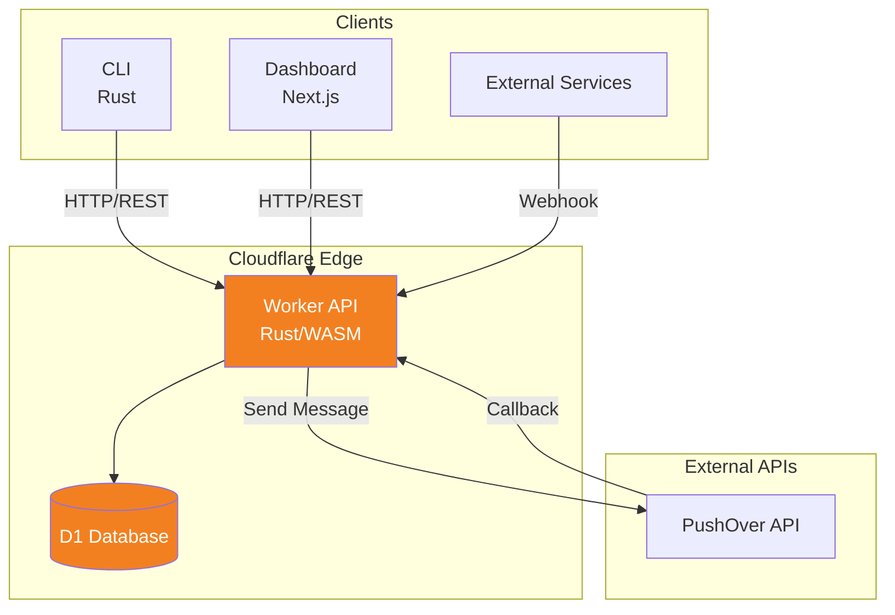
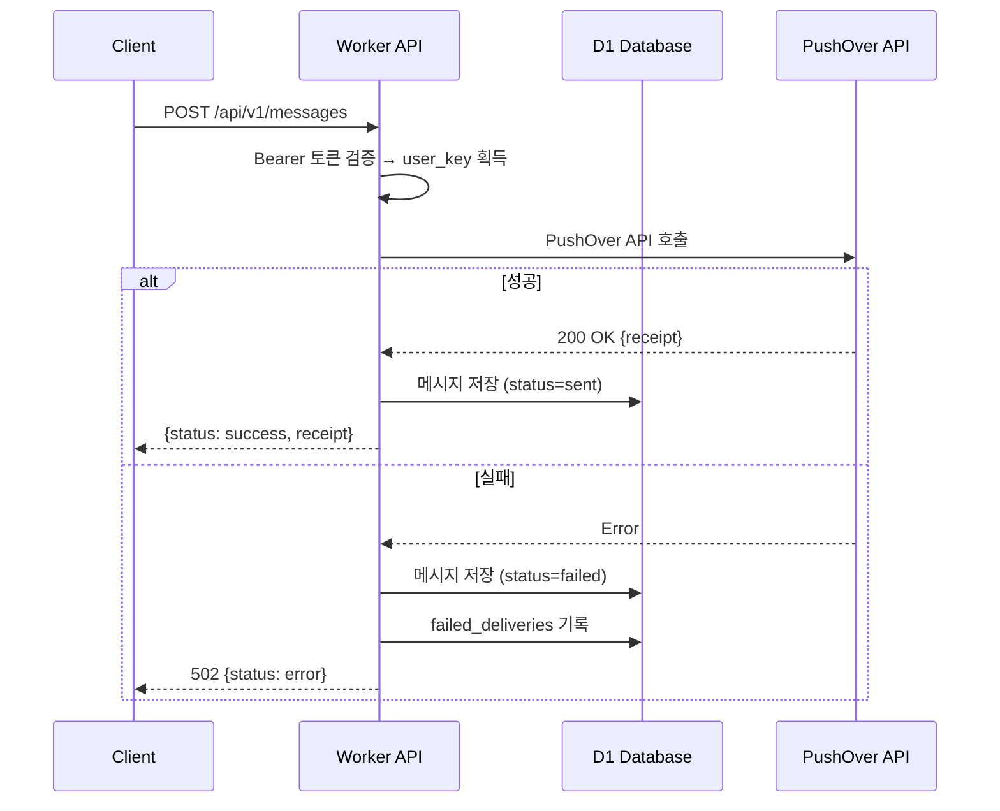
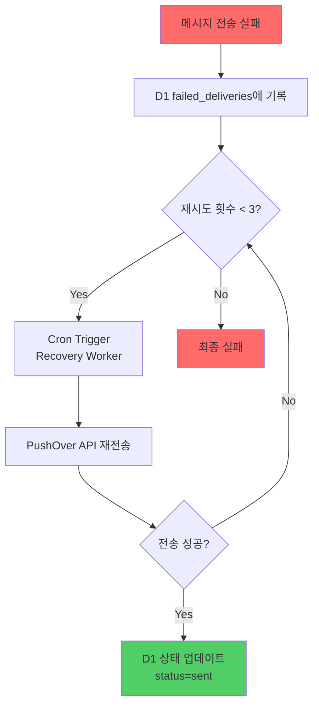
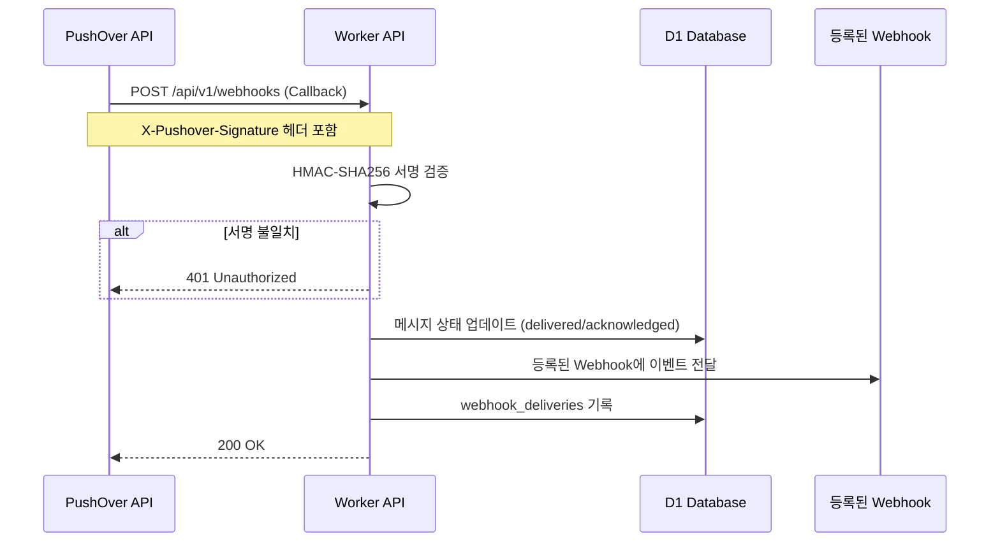

# PushOver Serverless Platform

PushOver API를 위한 Rust 기반 Serverless 플랫폼입니다. Cloudflare Workers + D1을 활용한 알림 시스템입니다.

---

## 🏗️ 아키텍처

### 전체 시스템 아키텍처



### 메시지 전송 흐름



### 재시도 메커니즘



### 웹훅 처리 흐름



### 웹훅 서명 검증


---

## ☁️ Cloudflare 서비스

| 서비스 | 용도 |
| -------- | ------ |
| **Workers** | Serverless API 서버 (Rust/WASM) |
| **D1** | SQLite 기반 DB (스키마: [`migrations/`](./migrations/)) |
| **Pages** | 정적 호스팅 (Dashboard) |
| **KV** | 키-값 스토어 (캐시) |
| **R2** | 오브젝트 스토리지 (Terraform state) |
| **Cron Triggers** | 스케줄러 (Recovery Worker, */5분) |

> 인프라 관리: D1, KV, R2, Cron Trigger는 `infrastructure/`의 **OpenTofu**로 관리. Worker 배포는 `wrangler` 사용.

---

## 📦 프로젝트 구조

```bash
pushover/
├── crates/
│   ├── sdk/                    # Rust SDK
│   ├── cli/                    # CLI 도구
│   └── worker/                 # Cloudflare Worker
│       └── wrangler.toml
├── dashboard/                  # Next.js 웹 UI
├── migrations/                  # D1 마이그레이션
├── infrastructure/              # OpenTofu 인프라
└── docs/                       # 문서
```

---

## 🗄️ 데이터베이스

> 스키마 상세: [`migrations/`](./migrations/) SQL 파일 참조
> 
**D1 테이블**:

- `api_tokens` - API 인증 토큰
- `messages` - 메시지 전송 기록
- `webhooks` - 웹훅 등록 정보
- `webhook_deliveries` - 웹훅 전송 기록
- `failed_deliveries` - 실패한 메시지 (재시도용)

---

## 🚀 빠른 시작

### 사전 요구사항

**개발 환경**:

- Rust 1.92.0
- Node.js v24.14.0
- pnpm 10.30.3

```bash
# Cloudflare Workers Rust/WASM 빌드 도구
cargo install worker-build
```

### 환경변수 설정

```bash
cp .env.example .env
# .env 파일을 실제 값으로 변경
```

**필수 환경변수**:

| 변수명 | 발급처 |
| -------- | -------- |
| `CLOUDFLARE_API_TOKEN` | [Cloudflare Dashboard](https://dash.cloudflare.com/profile/api-tokens) |
| `CLOUDFLARE_ACCOUNT_ID` | Cloudflare Dashboard 사이드바 |
| `PUSHOVER_USER_KEY` | [PushOver](https://pushover.net) |
| `PUSHOVER_API_TOKEN` | PushOver Settings → Applications |
| `PUSHOVER_WEBHOOK_SECRET` | `openssl rand -base64 32` |

### 설치 및 실행

```bash
# 의존성 설치
pnpm install

# Worker 빌드 & 배포
cd crates/worker
wrangler deploy

# Dashboard 실행
cd dashboard && pnpm dev
```

---

## 🧪 테스트

### Worker API

```bash
make test-api           # 기본 실행
make test-api-verbose   # 상세 출력
```

### Dashboard (Playwright)

```bash
make dashboard-test-loc   # 로컬 테스트
make dashboard-test-dev   # dev 환경 테스트
make dashboard-test-all   # 전체 테스트
```

---

## 🚀 배포

### Infrastructure (OpenTofu)

```bash
cd infrastructure
tofu init
tofu plan
tofu apply
```

### Worker

```bash
cd crates/worker
wrangler deploy
```

### Dashboard (Cloudflare Pages)

```bash
cd dashboard
pnpm run pages:build
pnpm run deploy
```

---

## 📝 라이선스

MIT
