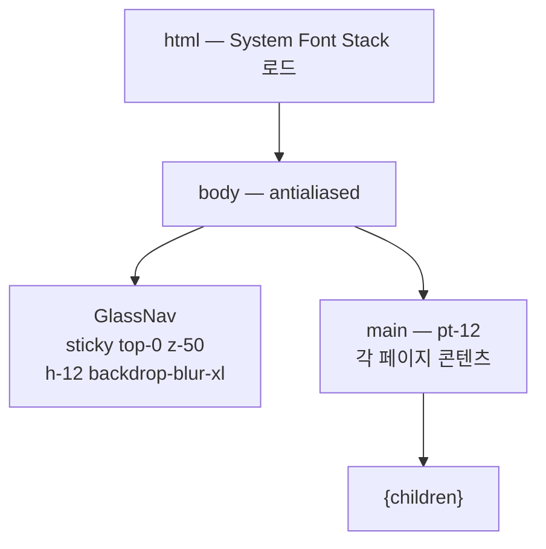
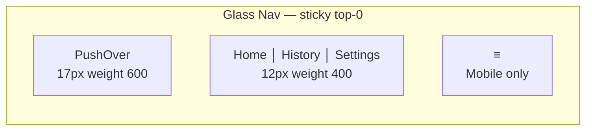
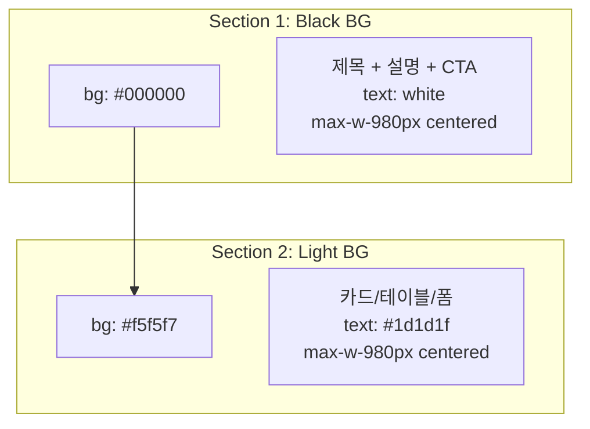
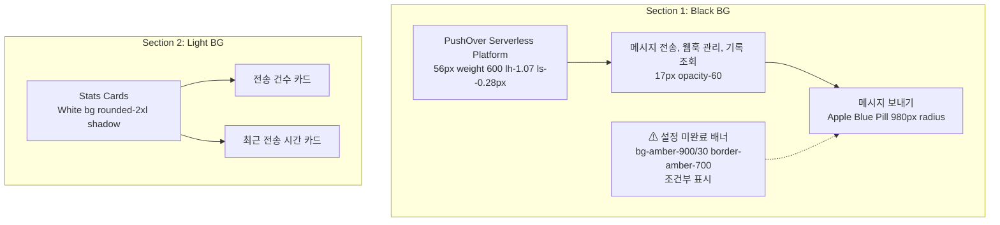
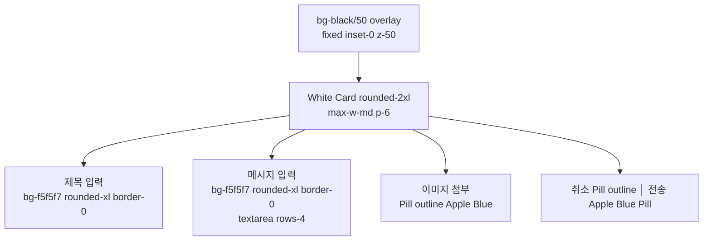
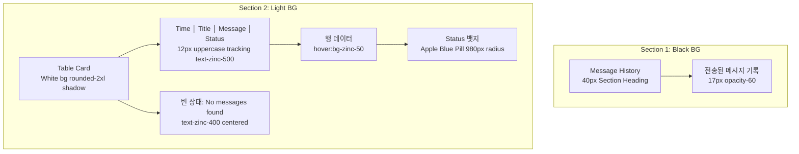
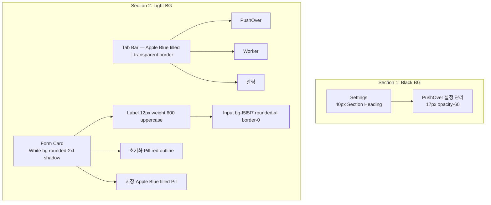

# Apple Design System Dashboard Redesign Spec

> **날짜**: 2026-04-06
> **상태**: Draft
> **범위**: Dashboard 전체 3페이지 (Home, History, Settings)

## 1. 개요

PushOver Dashboard를 Apple 공식 웹사이트의 디자인 언어로 전면 리디자인한다.
핵심 원칙: **Binary Light/Dark 교차 섹션** + **Apple Blue 단일 악센트** + **System Font Stack**.

---

## 2. 디자인 토큰

### 2.1 컬러 팔레트

#### Primary

| 토큰 | 값 | 용도 |
|---|---|---|
| `--color-apple-black` | `#000000` | Hero/다크 섹션 배경 |
| `--color-apple-light` | `#f5f5f7` | 라이트 섹션 배경 |
| `--color-apple-near-black` | `#1d1d1f` | 라이트 배경 본문 텍스트, 다크 버튼 fill |
| `--color-apple-white` | `#ffffff` | 다크 배경 텍스트, 버튼 텍스트 |

#### Interactive

| 토큰 | 값 | 용도 |
|---|---|---|
| `--color-apple-blue` | `#0071e3` | Primary CTA 배경, 포커스 링 |
| `--color-apple-blue-hover` | `#0077ed` | CTA 호버 상태 |
| `--color-apple-link` | `#0066cc` | 라이트 배경 인라인 링크 |
| `--color-apple-link-dark` | `#2997ff` | 다크 배경 링크 |

#### Surface (다크 섹션 내)

| 토큰 | 값 | 용도 |
|---|---|---|
| `--color-apple-card-dark` | `#1d1d1f` | 다크 섹션 카드 배경 |
| `--color-apple-surface-dark` | `#272729` | 다크 섹션 surface 변형 |

#### Functional

| 토큰 | 값 | 용도 |
|---|---|---|
| `--color-apple-success` | `#22c55e` | 성공 뱃지 |
| `--color-apple-warning` | `#f59e0b` | 경고 뱃지/배너 |
| `--color-apple-error` | `#ef4444` | 에러 뱃지/배너 |

#### Shadow

| 토큰 | 값 | 용도 |
|---|---|---|
| `--color-apple-shadow` | `rgba(0, 0, 0, 0.22) 3px 5px 30px 0px` | 카드 엘리베이션 |

### 2.2 타이포그래피

**폰트 스택**: `system-ui, -apple-system, BlinkMacSystemFont, 'SF Pro Display', 'SF Pro Text', 'Helvetica Neue', Arial, sans-serif`

| 역할 | 크기 | 무게 | 줄간격 | 레터 스페이싱 | 반응형 (Tablet → Mobile) |
|---|---|---|---|---|---|
| Display Hero | 56px | 600 | 1.07 | -0.28px | 40px → 28px |
| Section Heading | 40px | 600 | 1.10 | normal | 32px → 24px |
| Card Title | 21px | 700 | 1.19 | 0.231px | 19px → 17px |
| Body | 17px | 400 | 1.47 | -0.374px | 16px |
| Button | 17px | 400 | 2.41 | normal | — |
| Link | 14px | 400 | 1.43 | -0.224px | — |
| Caption | 14px | 400 | 1.29 | -0.224px | — |
| Label | 12px | 600 | — | normal | uppercase tracking |

### 2.3 Border Radius

| 역할 | 값 |
|---|---|
| 카드/컨테이너 | `16px` |
| 폼 필드 | `12px` |
| 버튼/뱃지 Pill | `980px` |
| 이미지 컨테이너 | `12px` |
| 모달 | `16px` |

---

## 3. 레이아웃 아키텍처

### 3.1 공유 레이아웃

모든 페이지가 공유 Glass Nav를 사용하도록 `layout.tsx`에 Nav 컴포넌트를 포함한다.

### 3.2 Glass Nav 컴포넌트

| 속성 | 값 |
|---|---|
| 배경 | `rgba(0, 0, 0, 0.8)` |
| 효과 | `backdrop-filter: saturate(180%) blur(20px)` |
| 높이 | `48px (h-12)` |
| 위치 | `sticky top-0 z-50` |
| 링크 폰트 | `12px, weight 400, white` |
| 호버 | `underline` |
| 모바일 | 햄버거 → 풀스크린 오버레이 메뉴 |

### 3.3 교차 섹션 패턴

모든 페이지는 **Black Hero → Light Content** 교차 구조를 따른다:

---

## 4. 페이지별 디자인

### 4.1 홈페이지 (`/`)

**메시지 전송 모달:**

### 4.2 히스토리 페이지 (`/history`)

### 4.3 설정 페이지 (`/settings`)

---

## 5. 컴포넌트 패턴

### 5.1 버튼 체계

| 유형 | 배경 | 텍스트 | 테두리 | Radius | 용도 |
|---|---|---|---|---|---|
| Primary CTA | `#0071e3` | `#fff` | 없음 | `980px` | 주요 액션 (전송, 저장) |
| Secondary | transparent | `#0071e3` | `1px solid #0071e3` | `980px` | 보조 액션 (취소, 이미지 첨부) |
| Destructive | transparent | `#ef4444` | `1px solid #ef4444` | `980px` | 위험 액션 (초기화) |
| Dark BG Link | transparent | `#2997ff` | 없음 | — | 다크 배경 내 링크 |
| Light BG Link | transparent | `#0066cc` | 없음 | — | 라이트 배경 내 링크 |

### 5.2 카드

| 컨텍스트 | 배경 | Shadow | Border | Radius |
|---|---|---|---|---|
| Light 섹션 내 | `#ffffff` | `var(--color-apple-shadow)` | 없음 | `16px` |
| Dark 섹션 내 | `#1d1d1f` | 없음 | 없음 | `16px` |
| Form 컨테이너 | `#ffffff` | `var(--color-apple-shadow)` | 없음 | `16px` |

### 5.3 폼 필드

| 속성 | 값 |
|---|---|
| 배경 | `#f5f5f7` |
| Border | `0` |
| Radius | `12px` |
| Padding | `12px` |
| Focus | `2px solid #0071e3` outline |
| Label | `12px, weight 600, uppercase, tracking, text-zinc-500` |
| Label 간격 | `margin-bottom: 6px` |

### 5.4 상태 뱃지

| 상태 | 배경 | 텍스트 | Radius |
|---|---|---|---|
| sent | `#0071e3` 10% opacity | `#0071e3` | `980px` |
| failed | `#ef4444` 10% opacity | `#ef4444` | `980px` |
| queued | `#f59e0b` 10% opacity | `#f59e0b` | `980px` |

### 5.5 배너 & 알림

| 상태 | 배경 | 테두리 | 텍스트 | 컨텍스트 |
|---|---|---|---|---|
| 설정 미완료 | `bg-amber-900/30` | `border-amber-700` | `text-amber-200` | Black 섹션 |
| 에러 | `bg-red-50` | `border-red-200` | `text-red-700` | Light 섹션 |
| 성공 | `bg-green-50` | `border-green-200` | `text-green-700` | Light 섹션 |

---

## 6. 반응형 동작

### 6.1 브레이크포인트

| 이름 | 범위 | 주요 변화 |
|---|---|---|
| Mobile | < 640px | 히어로 28px, 1컬럼, 햄버거 메뉴, 카드 stack |
| Tablet | 640-1024px | 히어로 40px, 2컬럼 카드, 모달 90% width |
| Desktop | > 1024px | 히어로 56px, max-w-980px, 전체 링크, 모달 max-w-md |

### 6.2 타이포그래피 스케일 다운

| 역할 | Desktop | Tablet | Mobile |
|---|---|---|---|
| Display Hero | 56px / -0.28px | 40px / -0.2px | 28px / -0.15px |
| Section Heading | 40px | 32px | 24px |
| Card Title | 21px | 19px | 17px |
| Body | 17px | 16px | 16px |

---

## 7. 접근성

| 항목 | 적용 |
|---|---|
| Focus Ring | 모든 interactive 요소에 `2px solid #0071e3` outline |
| 터치 타겟 | 최소 44x44px |
| 색 대비 | Black bg + White text, Light bg + #1d1d1f (WCAG AA 이상) |
| 스크롤 잠금 | 모달 오픈 시 `overflow: hidden` |
| 시맨틱 HTML | `<nav>`, `<main>`, `<section>`, `<article>` |
| 에러 표시 | `role="alert"` + `aria-live="polite"` |

---

## 8. 마이그레이션 계획

### Phase 1: 기반 작업

| 파일 | 작업 |
|---|---|
| `globals.css` | `@theme` 토큰 정의 (컬러, 폰트, 쉐도우, radius) |
| `layout.tsx` | 공유 GlassNav 포함, `<main className="pt-12">` 적용 |
| `components/GlassNav.tsx` | 신규 생성 — sticky translucent nav |

### Phase 2: 홈페이지

| 파일 | 작업 |
|---|---|
| `page.tsx` (Home) | 교차 섹션 구조, Black Hero → Light Stats, 모달 Apple 스타일 |

### Phase 3: 히스토리

| 파일 | 작업 |
|---|---|
| `history/page.tsx` | Black Hero → Light Table, Apple 테이블 스타일 |

### Phase 4: 설정

| 파일 | 작업 |
|---|---|
| `settings/page.tsx` | Black Hero → Light Form, Apple 탭 바 |
| `settings/components/*.tsx` | Apple 폼 필드, Pill 버튼 적용 |

### 삭제 대상

| 대상 | 이유 |
|---|---|
| 각 페이지 내 인라인 `<nav>` | GlassNav 공유 컴포넌트로 대체 |
| `dark:` variant 클래스 | 교차 섹션 방식으로 불필요 |
| `bg-zinc-*` 하드코딩 | Apple 토큰으로 교체 |
| `bg-blue-600` 하드코딩 | `--color-apple-blue` 토큰 사용 |

---

## 9. 테스트 전략

| 영역 | 방법 |
|---|---|
| 시각적 회귀 | Playwright E2E 스크린샷 비교 (기존 테스트 업데이트) |
| 접근성 | `axe-core` 또는 수동 WCAG 체크리스트 |
| 반응형 | 3개 브레이크포인트 모바일/태블릿/데스크톱 E2E |
| 기능 | 기존 E2E 테스트 케이스 유지 (선택자 업데이트만) |
